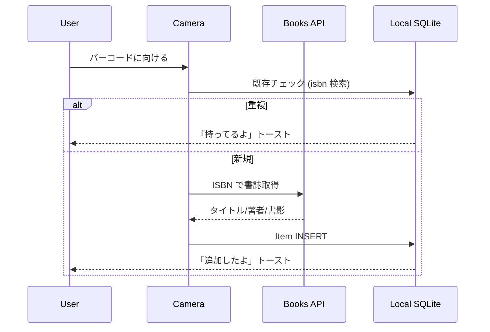

# Week 2026-W21 Selected: BarShelf

> Picked: 2026-05-23 07:44 JST
> From: candidates-3.md #2
> Status: idea

## TL;DR

バーコードを「パシャ」する一動作だけで本・CD・ゲームをデジタル棚に登録できる軽量モバイルアプリ。蔵書管理が続かないコレクター・積読常習犯向け。重複購入と「あの本どこ？」の常時ストレスを、入力レス習慣で潰す。

## 課題

### 痛みの当事者

30 代後半・男性・年間 60 冊以上買う本好き。物理本も Kindle も混在。本棚は 3 つ + 床積み 2 山。Amazon でポチった直後に「あれ、これ持ってたかも…」と棚を漁って 10 分溶かす月数回。友達に貸した技術書を 2 年前から回収できていない。Notion で蔵書管理を 3 回挫折。スプレッドシートも 50 件で入力疲れ。

### 現状の我慢

- 重複購入してから「あー、また買っちゃった」と諦める（年間 5,000-10,000 円のロス）
- 物理棚を毎回しゃがんで目視確認
- 貸した記憶は LINE 検索で頑張る
- 「いつかリスト化する」と思って 5 年経過

### 既存解決策と限界

| 既存 | 限界 |
|------|------|
| ブクログ・読書メーター | SNS 機能多すぎ、入力の摩擦は減らない、UI が読書記録寄り |
| Notion テンプレート | 手打ち前提、続かない |
| Sortly などの汎用在庫アプリ | 商業向け UI、書誌情報の自動取得が弱い |
| LibraryThing | UI が古い、モバイル体験が貧弱 |
| Eight (CD) / Discogs | 専用すぎる、本と CD と Steam を 1 つで管理できない |

決定打は「3 タップ以内で 1 冊登録完了」。これを満たすアプリが意外と無い。

## 解決アイデア

### コアコンセプト

**「カメラを向ける → ピッ → 終わり」を最短経路で実現する蔵書スキャナー。**

機能を増やさず、登録までの摩擦をゼロに近づけることに全振り。

### MVP に含めるもの

- カメラで ISBN/JAN バーコードをスキャン → Open Library / Google Books API で書影・タイトル・著者・出版年を自動取得
- ローカル SQLite に保存（クラウド同期は MVP では持たない）
- 検索・一覧表示・カテゴリ絞り込み（書籍 / CD / ゲーム）
- 「貸し出し中」フラグ + 貸した相手メモ欄（自由入力）
- 重複スキャン時に「これ持ってるよ」トースト表示 + 詳細ジャンプ

### MVP に絶対含めないもの

- クラウド同期・複数端末対応（端末壊れたら泣くしかない）
- SNS / シェア機能
- 読書進捗・レーティング（本質的に蔵書管理アプリだから）
- 複数物理棚の場所管理（「本棚 A の 3 段目」みたいなやつ）
- 手入力での新規登録 UI（ISBN なしの本は今週版では諦める）
- バックアップ機能（CSV export くらいは出すかも、要再検討）

## 技術スケッチ

### スタック

- 言語: TypeScript
- フレームワーク: React Native (Expo SDK 最新版)
- ライブラリ:
  - `expo-camera` または `expo-barcode-scanner` でスキャン
  - `expo-sqlite` でローカル DB
  - Open Library API (一次) + Google Books API (フォールバック) で書誌取得
- ホスティング: TestFlight（iOS）+ EAS Build で APK 直配布（Android）
- 配布: App Store / Play Store は出さない（審査コストが 1 週間スコープを超える）

### データモデル

```
Item
├── id (uuid)
├── isbn / jan (string)
├── title (string)
├── authors (json array)
├── publisher (string?)
├── published_year (int?)
├── cover_url (string?)
├── category (enum: BOOK | CD | GAME)
├── added_at (datetime)
├── lent_to (string?)        -- 貸し出し相手メモ
└── lent_at (datetime?)

ScanLog
├── id (uuid)
├── item_id (uuid?)           -- 一致した既存アイテム or null
├── raw_code (string)         -- スキャンした生コード
├── result (enum: NEW | DUPLICATE | UNKNOWN)
└── scanned_at (datetime)
```

ScanLog は MVP には不要かもしれないが、デバッグ用に薄く入れておく。

### 概念図



## 1 週間スケジュール

| Day | 日付 | 内容 |
|-----|------|------|
| 1 | 金 (5/22) 夜 | リポ作成 + Expo init + バーコードスキャン PoC（画面に値だけ表示） |
| 2 | 土 (5/23) | Open Library / Google Books API 叩いて書誌取得 → 画面表示 |
| 3 | 日 (5/24) | SQLite スキーマ + 保存 + 一覧画面 |
| 4 | 月 (5/25) | 重複検知 + トースト UI + カテゴリ絞り込み |
| 5 | 火 (5/26) | 「貸し出し中」機能 + 検索 |
| 6 | 水 (5/27) | バグ修正 + デザイン整え + TestFlight / EAS Build でビルド |
| 7 | 木 (5/28) | 友達 5 人に配って「使いたい？」聞く + フィードバック収集 |

> 注: 業務外時間 1 日 1-2h 想定。Day 2-3 は休日でやや余裕を持って配分。

## 検証方法

- 5 人にビルドを配布（本好き 3 + CD/ゲーム好き 2）
- 「自分の棚 10 冊をスキャンしてみて」と依頼
- 5 分以内に 10 冊登録できるか測る
- 「今後も使いたい？」を 3 段階（使う / 気が向けば / 使わない）で回答
- 「使う」が 3 人以上 → 成功 → 継続深掘り
- 2 人以下 → 何が刺さらなかったか掘って撤退 or ピボット判断

## リスク・代替案

- **リスク 1: Open Library / Google Books の ISBN 網羅率が低い**
  - 縮退: 日本の書籍は Open Library カバレッジが弱い可能性大。NDL Search API / 楽天ブックス API へ即フォールバック追加
  - さらに最悪: タイトルだけでも自動入力できれば OK と妥協
- **リスク 2: バーコードスキャンの精度が出ない（暗所・反射）**
  - 縮退: フラッシュ強制 ON + 手動 ISBN 入力フォーム
- **リスク 3: Expo Camera のネイティブビルドが詰まる**
  - 縮退: Expo Go で動く範囲に絞る（カスタムネイティブモジュールを諦める）
- **リスク 4: 1 週間で TestFlight 配布まで届かない**
  - 縮退: 内輪 5 人は Android 中心にして EAS Build APK 配布のみで完結
- **撤退判断**: Day 3 終了時点で「カメラ → API → 保存」の一連が動かないなら、深掘りを止めて素直に手入力アプリにグレードダウンするか、来週案へ巻き戻る

## 次のアクション

- [ ] リポジトリ作成: `gh repo create kaionn/barshelf --public` で新規リポ
  - or `lazy-product-lab/poc/barshelf/` に PoC として置く（撤退時の廃棄が楽）
- [ ] スタート曜日: 今夜（金 5/22 夜）開始予定 → 既に過ぎているので今日（土 5/23）から実質 Day 1 スタートとして再計画
- [ ] 検証相手 5 人を当てる: 本好き 3 / CD・ゲーム好き 2 の候補を洗い出して声がけ
- [ ] Open Library + Google Books の日本書籍カバレッジを 10 冊くらいの ISBN で先に確認しておく（着手判断材料）
