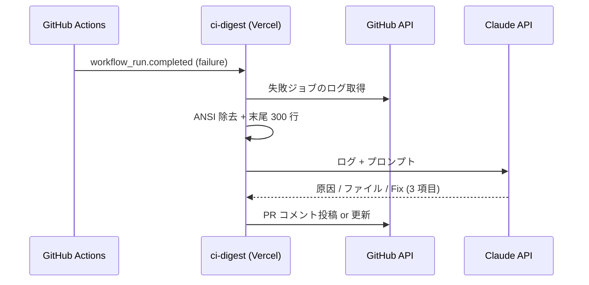

# Week 2026-W29 Selected: ci-digest

> Picked: 2026-07-15 19:53 JST
> From: candidates.md #1
> Status: idea
> Selected via: #2

## TL;DR

CI 失敗ログを AI が「原因・該当ファイル・提案 Fix」の 3 行に圧縮して PR に自動コメントする GitHub App。ANSI まみれの数百行ログをスクロールして原因を探す時間を、個人・小チーム開発者から取り返す。「ログを ChatGPT にコピペする」手作業を webhook でゼロにするのが肝。

## 課題

### 痛みの当事者

個人開発 + 小規模チームで働くフルスタック開発者。自動化 repo を複数持ち、GitHub Actions の CI/CD を日常的に使う。CI が落ちるたびに Actions のログページを開き、`##[error]` を探してスクロールし、原因が非自明なら Stack Overflow や AI チャットにログを貼って 20 分溶かす。これが週 3〜4 回ある。

### 現状の我慢

- Actions のログ UI で `Cmd+F` → "error" 検索 → ノイズ（warning や echo の "error" 文字列）に埋もれる
- `gh run view --log-failed` で端末に流すが、ANSI エスケープと数百行のスタックトレースは結局人力で読む
- 原因が分からなければログをコピペして AI チャットへ。毎回同じ前処理（ANSI 除去・関係部分の切り出し）を手でやる

### 既存解決策と限界

| 解決策 | 限界 |
|--------|------|
| GitHub 純正の failed step 表示 | 「どの step が落ちたか」までで「なぜか」がない |
| `gh run view --log-failed` | 生ログが出るだけ。解読は人間の仕事のまま |
| AI チャットへ手動コピペ | 毎回の手作業。ログ取得 → 整形 → 貼り付けで 5 分、文脈説明でさらに数分 |
| Datadog CI Visibility 等の SaaS | 個人・小チームにはオーバーキル + 有料 |

## 解決アイデア

### コアコンセプト

「CI が落ちたら、原因の 3 行サマリが PR に勝手に生えてる」

### MVP に含めるもの

1. GitHub App（webhook: `workflow_run.completed` / conclusion=failure）を Vercel Serverless Functions で受ける
2. 失敗ジョブのログを GitHub API で取得 → ANSI 除去 → 末尾 300 行に切り詰め
3. Claude API（claude-haiku-4-5）に投げ、「原因 / 該当ファイル / 提案 Fix」の 3 項目・日本語で出力
4. PR に digest コメントを自動投稿。同一 PR に既存 digest があれば新規投稿でなく更新（コメントスパム防止）
5. リポジトリルートの `.ci-digest.yml` で除外ジョブ名リストを設定可能に

### MVP に絶対含めないもの

- ログ前半・全文の解析（末尾 300 行で割り切る）
- マトリクスビルドの全並列ジョブ解析（最初に見つけた失敗ジョブのみ）
- 多言語対応（日本語固定）
- GitHub Enterprise 対応
- レートリミット時のリトライ（黙ってスキップ）
- ダッシュボード・履歴 UI・課金

## 技術スケッチ

### スタック

- 言語: TypeScript (Node.js)
- フレームワーク: @octokit/webhooks + @octokit/app + Vercel Serverless Functions
- LLM: Claude API（claude-haiku-4-5、コスト最小化）
- 状態管理: Upstash Redis（Vercel Marketplace 統合。コメント ID の記録と連続失敗カウント用）
- 配布: GitHub App として手動インストール（Marketplace 公開はしない）

### データモデル

| エンティティ | キー | 値 | 用途 |
|---|---|---|---|
| DigestComment | `digest:{repo}:{pr_number}` | comment_id | 既存コメントの更新先特定 |
| FailureStreak | `streak:{repo}:{workflow_name}` | 連続失敗回数 | 3 回以上で「環境問題の可能性あり」バッジ |

DB レス。Redis の 2 キーだけで成立する。

### 概念図

## 1 週間スケジュール

| Day | 日付 | 内容 |
|-----|------|------|
| 1 | 7/17 (金) 夜 | GitHub App 登録・秘密鍵設定・Vercel に webhook 受け口 + 署名検証 |
| 2 | 7/18 (土) | ログ取得 → ANSI 除去 → 300 行切り詰めのパイプライン |
| 3 | 7/19 (日) | Claude API 連携 + PR コメント投稿（コア機能完成） |
| 4 | 7/20 (月) | コメント更新方式 + `.ci-digest.yml` 除外リスト |
| 5 | 7/21 (火) | 連続失敗バッジ (Upstash) + わざと CI を落とすテスト repo で検証 |
| 6 | 7/22 (水) | Vercel production デプロイ + 自分の automation repo 群にインストール |
| 7 | 7/23 (木) | 内輪に共有 + フィードバック回収 |

## 検証方法

まず自分の automation repo（lazy-product-lab / pain-collector / tech-news-daily 等）にインストールして 1 週間ドッグフーディング。その上で知人 5 人にデモし「自分の repo に入れたい」を 3 人取れたら成功。

## リスク・代替案

- リスク: GitHub App の認証（JWT → installation token）+ webhook 署名検証の初期セットアップが Day 1 で終わらない
  - 縮退: App 化を捨て、reusable workflow（`on: workflow_call` + PAT）として自分の repo 限定で動かす。webhook 不要になり大幅に単純化
- リスク: ログ末尾 300 行に原因が写っておらず digest の精度が低い
  - 縮退: `##[error]` 行の前後 50 行を優先的に抽出するヒューリスティックを 1 つだけ足す（それ以上は凝らない）
- 撤退判断: 2 週間運用して digest コメントを自分が読まなくなったら App をアンインストールして撤退。Vercel プロジェクト削除だけで済む（利用者を巻き込まない）

## 次のアクション

- [ ] `/lazy-product-bootstrap` で雛形リポ作成（API-only (Hono) ベースが近いが webhook 特化で調整）
- [ ] スタート曜日: 7/17 (金) 夜
- [ ] 検証相手 5 人を当てる（automation repo を持っている知人優先）
